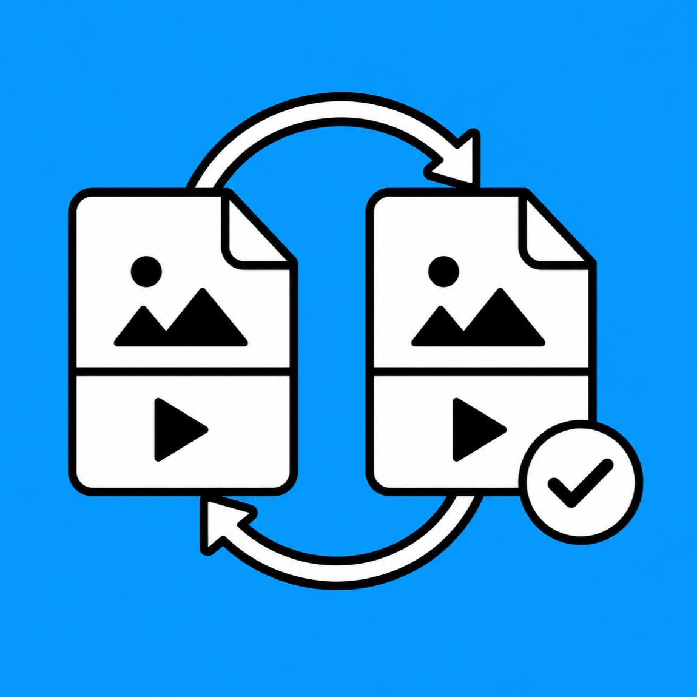
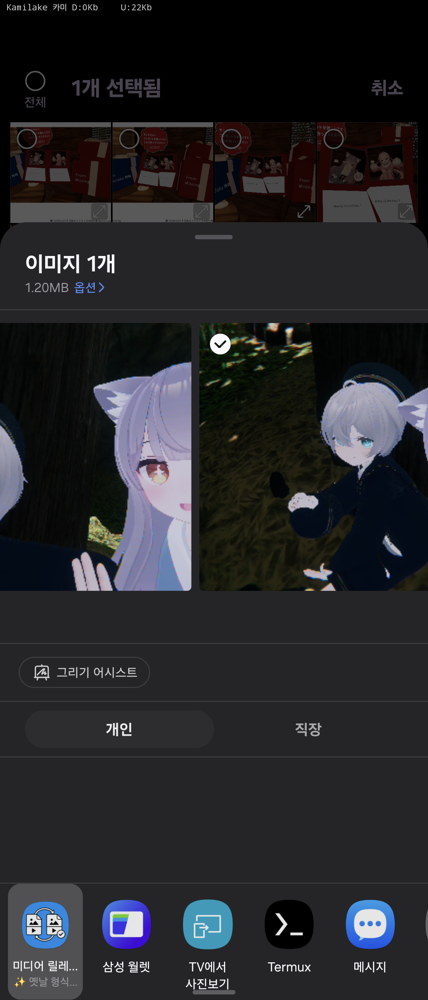
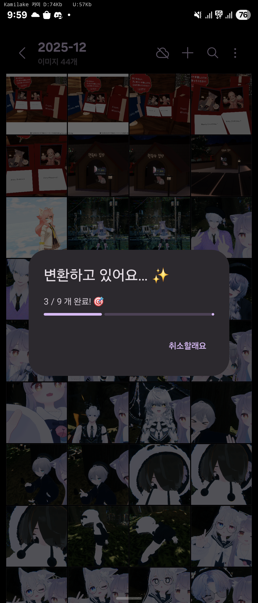

<div align="center">



# Media Relay Bridge

**HEIC · HEIF · AVIF · HEVC를 받아, JPEG · PNG · H.264 MP4로 다시 공유해주는 안드로이드 포맷 어댑터.**

[](https://www.android.com/)
[](#호환성)
[](https://kotlinlang.org/)
[](https://developer.android.com/jetpack/compose)
[](LICENSE)

[한국어](#한국어) · [English](#english)

</div>

---

## 한국어

### 왜 만들었나

요즘 안드로이드/iOS 카메라는 사진을 **HEIC/HEIF**, 동영상을 **HEVC**로 저장합니다. 그런데 일부 앱들은 이 포맷을 공유 인텐트로 받으면 그냥 **크래시**합니다.

- 💥 **Discord** — HEIC를 공유하면 강제 종료
- 💥 **여러 레거시 정부/공공 앱** — 같은 증상

이 앱은 그 사이를 메우는 **paste-through 포맷 어댑터**입니다.

```
[갤러리]  ──공유──▶  Media Relay Bridge  ──공유──▶  [Discord / 기타 앱]
                       (HEIC → JPEG)
```

UI는 거의 없습니다. 한번 설치하고 잊어버리세요. 공유 시트의 변환기로만 살아갑니다.

### 스크린샷

<table>
  <tr>
    <td align="center">
      <br/>
      <sub>① 갤러리에서 여러 장을 선택하고 공유 → <b>Media Relay Bridge</b> 선택</sub>
    </td>
    <td align="center">
      <br/>
      <sub>② 진행률 다이얼로그 (예: 9장 중 3장 변환 중)</sub>
    </td>
  </tr>
</table>

### 동작 방식

1. 갤러리/파일 앱에서 HEIC/HEVC 미디어를 **공유** 합니다.
2. 앱 선택지에서 **Media Relay Bridge**를 고릅니다.
3. 변환 진행률 다이얼로그가 잠시 떴다가, **시스템 공유 시트가 다시 뜹니다.**
4. 진짜 보내고 싶은 앱을 고르세요. 변환된 JPEG/PNG/MP4가 전달됩니다.

다중 선택(예: 25장 일괄)도 지원합니다. `Semaphore(2)`로 동시성 제한하며 병렬 처리하고, 한 항목이 실패해도 나머지는 계속 진행됩니다.

### 자동 변환 정책

| 입력 | 출력 |
|---|---|
| 알파 채널 있는 이미지 | **PNG** |
| 그 외 이미지 (HEIC/HEIF/AVIF/JPEG/...) | **JPEG-95** |
| 동영상 (HEVC/...) | **H.264 + AAC**, MP4, ≤ 1280×720, 30fps, 6Mbps |

원본은 영구 저장하지 않습니다. 변환 결과는 `cacheDir/converted/`에 임시로 만들어 OS가 회수하게 둡니다.

### 핵심 기술 포인트

#### 1. 4단계 디코더 폴백 (`ImageConverter`)

시스템 디코더가 거부하는 8K HEIC도 살리기 위해:

```
1. ImageDecoder (default)
2. ImageDecoder (ALLOCATOR_SOFTWARE)
3. HeifParser → HevcStillDecoder    ← 자체 ISO BMFF 파서 + MediaCodec 직구동
4. BitmapFactory                    ← plain JPEG/PNG 안전망
```

#### 2. 자체 ISO BMFF/HEIF 파서 (`HeifParser`)

외부 mp4 라이브러리 없이 필요한 박스만 직접 파싱합니다:
`ftyp`, `meta/pitm`, `iinf/infe`, `iloc` (v0/1/2), `iprp/ipco` (`ispe`, `hvcC`), `iprp/ipma`, `iref/dimg`.

#### 3. HEVC Still 디코더 (`HevcStillDecoder`)

HEIF 안의 HEVC NAL은 length-prefixed라 MediaCodec에 그대로 못 넣습니다. 두 단계 변환 후 디코드:

1. `hvcC` → CSD-0 (VPS/SPS/PPS를 Annex-B start code로 변환)
2. payload → Annex-B (lengthSize = `hvcC[21] & 0x3 + 1`)
3. `MediaCodecList`에서 8K가 fit하는 디코더 선택 (HW 우선)
4. `ImageReader(YUV_420_888)` 출력 → BT.601 limited-range로 ARGB_8888

#### 4. 신뢰할 수 없는 MIME 보정 (`MediaType`)

HEIC가 `image/jpeg`로 위장되는 사례(예: 카카오톡 경유) 대응. **MIME + 확장자 + ftyp brand** 세 신호를 합산해 분류합니다.

#### 5. 실패 격리 + 보수적 동시성

- per-item `try/catch`: 한 장 실패가 24장을 죽이지 않음.
- 동시성 = `min(2, cpu/2)`: 8K HEVC 디코더 인스턴스가 무겁고 HW 풀이 작음.
- `largeHeap=true`: 8K ARGB 비트맵 ≈ 132MB.

### 호환성

| 항목 | 값 |
|---|---|
| `minSdk` | **35** (Android 15) |
| `targetSdk` / `compileSdk` | 36 (minor 1) |
| 빌드 | AGP 9.2.x · Kotlin 2.2.x · JDK 11 |

> ⚠️ `minSdk=35`는 의도적입니다. 이 앱은 작성자가 본인의 현행 폰에서 쓰는 도구로 시작했기 때문에 호환성 부담을 일부러 내려놓았습니다. 더 낮은 SDK가 필요하다면 PR/포크를 환영합니다.

### 빌드 / 설치

```powershell
# debug 빌드
.\gradlew.bat assembleDebug

# release 빌드
.\gradlew.bat assembleRelease

# 디바이스 설치
.\gradlew.bat installDebug
```

### 디버깅 팁

```powershell
# logcat 필터
adb logcat -s ShareReceiver ImageConverter HevcStill HeifParser

# debug 빌드에서 디바이스의 HEVC 디코더 카탈로그 보기
adb logcat -s CodecDiag

# 로컬 HEIC의 ISO BMFF 박스 트리 덤프
pwsh diag/dump-isobmff.ps1 your-file.heic
```

### 프로젝트 구조

```
app/src/main/java/com/kamilake/mediaconverter/
├── MainActivity.kt              # 안내문 한 장 (Compose)
├── ShareReceiverActivity.kt     # 본체 — 공유 인텐트 진입점
├── ui/theme/                    # Compose 테마
└── convert/
    ├── MediaType.kt             # MIME / 확장자 / ftyp brand 합산 분류
    ├── ConversionResult.kt      # sealed: Success / Skipped / Failed
    ├── ImageConverter.kt        # 4단계 폴백 디코더 → JPEG/PNG
    ├── VideoConverter.kt        # otaliastudios Transcoder 위임
    ├── HeifParser.kt            # 자체 ISO BMFF/HEIF 파서
    ├── HevcStillDecoder.kt      # MediaCodec 직접 구동
    └── CodecDiagnostics.kt      # debug 빌드 전용 카탈로그 로그
```

자세한 설계 컨텍스트는 [`docs/PROJECT.md`](docs/PROJECT.md), 8K HEIC 안정화 작업은 [`docs/worklog-2026-05-08.md`](docs/worklog-2026-05-08.md) 참고.

### 로드맵

- [ ] **HEIC 그리드 디코드** — iPhone 사진은 보통 grid + 다중 hvc1 타일. 파싱은 됨, 합성 필요.
- [ ] **EXIF 보존** — 회전/방향 정보 누락 중.
- [ ] **컬러 매트릭스 정밀화** — 현재 BT.601 고정. `colr` 박스로 BT.709 / BT.2020 / full-range 인지.
- [ ] **YUV→ARGB 가속** — 8K에서 100MB+ 픽셀 루프. GPU shader 또는 libyuv 검토.
- [ ] **CI** — Gradle build/lint를 GitHub Actions로.
- [ ] **F-Droid / Play Store 배포 검토.**

### 기여하기

이슈 / PR 환영합니다. 작은 1인 도구로 시작했지만 같은 문제를 겪는 사람이 있을 거라 믿고 공개합니다.

기여 전에 [`docs/PROJECT.md`](docs/PROJECT.md)의 **§5 모듈별 책임**과 **§9 디자인 결정 메모**를 한 번 읽어주시면 컨텍스트가 빠르게 잡힙니다.

### 라이선스

[MIT License](LICENSE).

### 감사

- [otaliastudios/transcoder](https://github.com/natario1/Transcoder) — 비디오 트랜스코딩 파이프라인
- ISO/IEC 14496-12 (ISO BMFF) · ISO/IEC 23008-12 (HEIF) 명세

---

## English

### Why

Modern Android/iOS cameras default to **HEIC/HEIF** for photos and **HEVC** for video. But several apps still **crash** when they receive these formats via share intents — Discord and a number of legacy government apps among them.

Media Relay Bridge is a tiny **paste-through format adapter** that sits between them:

```
[Gallery]  ──share──▶  Media Relay Bridge  ──share──▶  [Discord / ...]
                         (HEIC → JPEG)
```

There is essentially **no UI** — install once, then it lives only in the share sheet.

### Screenshots

<table>
  <tr>
    <td align="center">
      <br/>
      <sub>① Pick multiple items in the gallery and share → choose <b>Media Relay Bridge</b></sub>
    </td>
    <td align="center">
      <br/>
      <sub>② Progress dialog (e.g. converting 3 of 9)</sub>
    </td>
  </tr>
</table>

### How it works

1. Share an HEIC/HEVC item from your gallery or files app.
2. Pick **Media Relay Bridge** in the chooser.
3. A brief progress dialog appears, then the **system share sheet pops up again** — with the converted JPEG/PNG/MP4.
4. Send to the app you actually wanted.

Multi-share (e.g. 25 photos) is supported with bounded parallelism (`Semaphore(2)`); per-item failures are isolated.

### Conversion policy

| Input | Output |
|---|---|
| Image with alpha | **PNG** |
| Other images (HEIC/HEIF/AVIF/JPEG/...) | **JPEG-95** |
| Video (HEVC/...) | **H.264 + AAC** MP4, ≤ 1280×720, 30fps, 6 Mbps |

Originals are never persisted; outputs go to `cacheDir/converted/`.

### Highlights

- **4-stage decoder fallback** in `ImageConverter`: `ImageDecoder` → `ImageDecoder(SOFTWARE)` → custom `HeifParser` + `HevcStillDecoder` → `BitmapFactory`.
- **In-tree ISO BMFF / HEIF parser** — no heavy mp4 dependency. Parses just the boxes we need (`ftyp`, `meta/pitm`, `iinf/infe`, `iloc` v0/1/2, `iprp/{ipco,ipma}`, `iref/dimg`).
- **Direct MediaCodec HEVC still decoder** — converts `hvcC` → CSD-0, length-prefixed NAL → Annex-B, picks an 8K-capable HW decoder, reads `ImageReader(YUV_420_888)`, emits ARGB_8888 (BT.601 limited).
- **MIME spoof tolerant** — MIME + extension + `ftyp` brand triangulation.
- **Failure isolation + conservative concurrency** — one bad photo doesn't kill the batch; concurrency capped at `min(2, cpu/2)` because 8K HEVC instances are heavy.

### Build

```powershell
.\gradlew.bat assembleDebug    # or assembleRelease / installDebug
```

Requires JDK 11+, AGP 9.2.x. `minSdk = 35` (Android 15) — see [Compatibility](#호환성) above.

### Roadmap

- [ ] HEIC **grid** decode (iPhone photos are usually multi-tile)
- [ ] EXIF preservation (orientation)
- [ ] Color matrix awareness (`colr` box: BT.709 / BT.2020 / full range)
- [ ] GPU/libyuv accelerated YUV→ARGB
- [ ] GitHub Actions CI
- [ ] F-Droid / Play Store distribution

### License

[MIT License](LICENSE).
